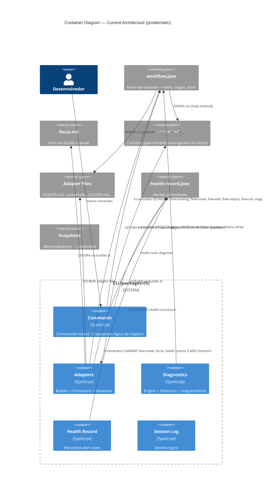
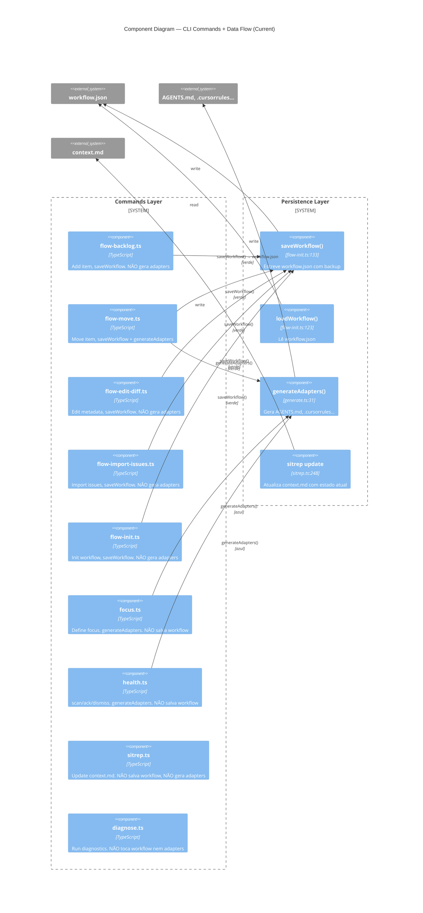
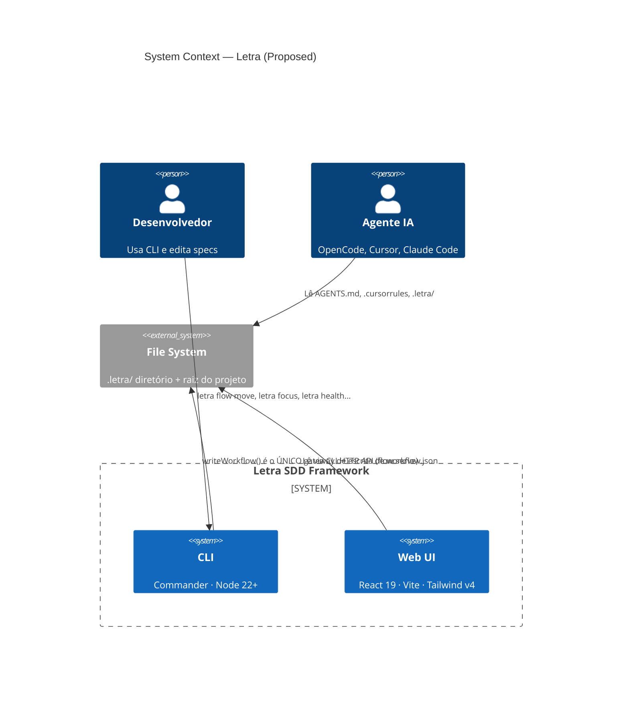
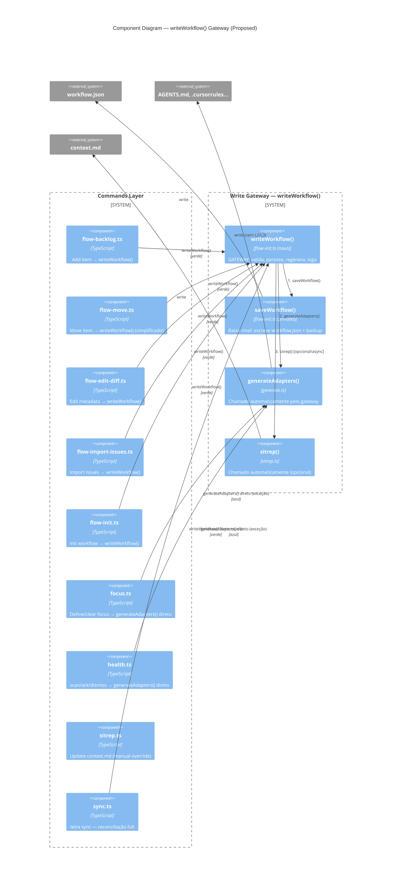
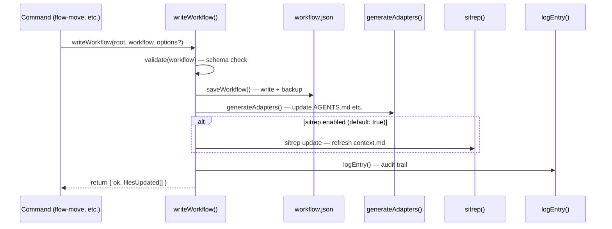

# Write-Sync: Motor de Sincronização e Fonte Única de Verdade

**Date**: 2026-06-16
**Status**: proposed

## Context

O Letra sofre de **inconsistência crônica entre fontes de estado**. Auditando o workspace em 16/06/2026, cada arquivo contava uma história diferente:

| Fonte | Afirmava | Real |
|---|---|---|
| `AGENTS.md` | ITEM-16 é o atual, estágio Backlog | ITEM-32 em Review, ITEM-16 não existe mais |
| `focus.md` | command-menu (ITEM-47) | ITEM-32 é o atual |
| `context.md` | "ITEM-33 (ruler header — revisão)" | ITEM-32 em Review |
| `pulse` (workflow.json) | ITEM-32 em Review, ITEM-22 no backlog | ✅ fonte da verdade |

6 comandos escrevem `workflow.json` de forma descentralizada. Cada um decide se regenera adapters, se atualiza context.md, se loga. Nenhum reconcilia os outros. O `stage-drift` detector tem um `autoFix` que faz `writeFileSync` direto no `workflow.json` — bypassando completamente `saveWorkflow()`, `generateAdapters()`, e `sitrep`.

O resultado: o agente (OpenCode, Cursor, etc.) recebe contexto inconsistente a cada sessão. A confiança no harness cai. O valor do produto — "contexto enriquecido para agentes" — degrada com o uso.

Este ADR propõe um **motor de sincronização (`writeWorkflow`)** que unifica toda mutação de workflow em um único gateway com side-effects garantidos.

## Architecture — C4 Diagrams

### Nível 1: Contexto do Sistema (HOJE)


### Nível 2: Containers — HOJE



### Nível 3: Componentes Internos do CLI — HOJE



---

### Nível 1: Contexto do Sistema (PROPOSTO)



### Nível 2: Containers — PROPOSTO

```mermaid
C4Container
title Container Diagram — Proposed Architecture (writeWorkflow gateway)

Person(dev, "Desenvolvedor")

System_Boundary(cli, "CLI (packages/cli)") {
  Container(wf_gateway, "writeWorkflow()", "TypeScript", "GATEWAY ÚNICO de mutação. Garante side-effects")
  Container(commands, "Commands", "TypeScript", "Commander-based. Chamam writeWorkflow()")
  Container(adapters, "Adapters", "TypeScript", "Builder + Formatters + Generate")
  Container(diagnostics, "Diagnostics", "TypeScript", "Engine + Detectors + SnapshotStore")
  Container(health, "Health Record", "TypeScript", "Persistent alert store")
  Container(log, "Session Log", "TypeScript", "session-log.ts")
  Container(sync_cmd, "letra sync", "TypeScript", "Reconciliação manual: regenera tudo a partir do workflow.json")
}

System_Ext(workflow_json, "workflow.json", "SINGLE SOURCE OF TRUTH — items, stages, tools")
System_Ext(focus_md, "focus.md", "Foco validado contra workflow (warning se stale)")
System_Ext(context_md, "context.md", "Contexto auto-sincronizado via sitrep dentro do gateway")
System_Ext(adapters_fs, "Adapter Files", "AGENTS.md, .cursorrules, CLAUDE.md — SEM lista de itens")
System_Ext(health_json, "health-record.json", "Alertas persistentes (independente)")
System_Ext(snapshots, "Snapshots", ".letra/snapshots/ — undo/redo")

Rel(dev, commands, "Invoca comandos")
Rel(commands, wf_gateway, "5 comandos chamam writeWorkflow(): backlog, move, edit, import, init", "verde")
Rel(focus, adapters, "focus chama generateAdapters() diretamente (não escreve workflow)", "azul")
Rel(health_cmd, adapters, "health chama generateAdapters() diretamente (não escreve workflow)", "azul")
Rel(wf_gateway, workflow_json, "1. saveWorkflow() interno", "verde")
Rel(wf_gateway, adapters, "2. generateAdapters() auto", "verde")
Rel(wf_gateway, context_md, "3. sitrep update auto (opcional/async)", "verde")
Rel(wf_gateway, log, "4. logEntry() auto", "verde")
Rel(adapters, adapters_fs, "ESCREVE adapter files (sem L2/L3)")
Rel(adapters, workflow_json, "LEITURA via builder.ts (read-only)")
Rel(adapters, focus_md, "LEITURA via builder.ts (validado)")
Rel(adapters, health_json, "LEITURA via builder.ts")
Rel(diagnostics, workflow_json, "stage-drift autoFix chama writeWorkflow() — NÃO writeFileSync direto")
Rel(sync_cmd, wf_gateway, "Reconciliação: regenera tudo do workflow.json")
Rel(health, health_json, "LÊ e ESCREVE health-record.json")

UpdateLayoutConfig($c4ShapeInRow="2", $c4BoundaryInRow="1")
```

### Nível 3: Componentes Internos do CLI — PROPOSTO



### Fluxo: writeWorkflow() — Sequência Interna



---

## Decision

Adotar o **Write-Sync Model**: toda mutação de `workflow.json` passa por um único gateway `writeWorkflow()` que garante side-effects consistentes.

### Contrato do Gateway

```typescript
interface WriteWorkflowOptions {
  workflow: Workflow;
  source: "flow-move" | "flow-backlog" | "flow-edit" | "flow-import" | "flow-init" | "stage-drift";
  skipAdapters?: boolean;    // default: false
  skipSitrep?: boolean;      // default: false (sitrep é caro — opcional)
  skipLog?: boolean;         // default: false
}

interface WriteWorkflowResult {
  ok: boolean;
  filesUpdated: string[];  // paths of generated/regenerated files
  error?: string;
}

function writeWorkflow(root: string, options: WriteWorkflowOptions): WriteWorkflowResult
```

### Regras de Side-Effect

| Side-effect | Quando | Skipável? |
|---|---|---|
| `saveWorkflow()` (write + backup) | Sempre | ❌ |
| `generateAdapters()` | Sempre | `skipAdapters: true` |
| `sitrep()` update context.md | Padrão: sim | `skipSitrep: true` |
| `logEntry()` | Sempre | `skipLog: true` |

### Adaptadores sem L2/L3

Remove-se do adapter (AGENTS.md, .cursorrules, etc.) as seções que duplicam estado mutável:

- **Remove L2** (`formatL2()` — lista de itens no estágio): o agente usa `letra pulse` para isso.
- **Remove L3** (`formatL3()` — sinais de trabalho): `letra pulse` também mostra.
- **Mantém L1** (referências a context.md, constitution.md, glossary.md, focus.md).
- **Mantém L5** (alertas do health record) — informação crítica que não tem outro canal.
- **Mantém** kickoff checklist, command menu, completion checklist, regras.

### Comandos afetados (antes → depois)

| Comando | Antes | Depois |
|---|---|---|
| `flow backlog add` | `saveWorkflow()` só | `writeWorkflow()` → adapters + sitrep |
| `flow move` | `saveWorkflow()` + `generateAdapters()` (manual) | `writeWorkflow()` → tudo automático |
| `flow edit` | `saveWorkflow()` só | `writeWorkflow()` → adapters + sitrep |
| `flow import` | `saveWorkflow()` só | `writeWorkflow()` → adapters + sitrep |
| `flow init` | `saveWorkflow()` só | `writeWorkflow()` → adapters + sitrep |
| `stage-drift autoFix` | `writeFileSync()` direto (backdoor) | `writeWorkflow()` via função importada |
| `focus` / `health` | `generateAdapters()` direto | Mantém `generateAdapters()` direto (não escrevem workflow) |

### Código morto após implementação

| Arquivo | Destino | Motivo |
|---|---|---|
| `formatters.ts:formatL2()` (~35 linhas) | Remover | Lista de itens removida do adapter |
| `formatters.ts:formatL3()` (~40 linhas) | Remover | Sinais de trabalho removidos do adapter |
| `builder.ts:51-85` (~35 linhas) | Simplificar/podar | Lógica de mapeamento de itens fica mais simples |
| `flow-move.ts:5` (import generateAdapters) | Remover | Substituído por `writeWorkflow()` |
| `stage-drift.ts:54-69` (autoFix writeFileSync) | Reescrever | Usar `writeWorkflow()` em vez de `writeFileSync` direto |
| `flow-backlog.ts:53`, `flow-edit.ts:85`, `flow-import.ts:129,239` | 1 linha cada | Trocar `saveWorkflow()` por `writeWorkflow()` |

**Total estimado de linhas removidas/simplificadas:** ~120 linhas.
**Total de novas linhas:** `writeWorkflow()` ~50 linhas + `sync.ts` ~80 linhas = ~130 linhas.
**Saldo líquido:** aproximadamente neutro.

### O que NÃO muda

- `health-record.ts` — independente, não passa pelo gateway
- `diagnostics/engine.ts` — não toca workflow.json
- `diagnostics/detectors/*` — só `stage-drift` muda
- `diagnostics/snapshot.ts` — independente
- `validation/` — domínio separado
- `packages/client/` — lê via HTTP API, sem mudança
- `session-log.ts` — já é chamado individualmente

## Consequences

**Positivo:**

- **Consistência garantida**: toda mutação de workflow regenera adapters e (opcionalmente) context.md. Fim do drift entre AGENTS.md, context.md e workflow.json.
- **Audit trail completo**: `logEntry()` automático em toda mutação.
- **Código mais simples**: 5 comandos deixam de gerenciar side-effects manualmente.
- **Backdoor fechado**: `stage-drift` não consegue mais escrever direto no workflow.json.
- **Adapter mais leve**: sem L2/L3, fica ~30% menor e nunca stale.
- **`letra sync`** como "botão de pânico" para reconciliação manual.

**Negativo:**

- **Behavior change**: `flow backlog add`, `flow edit`, `flow import` vão começar a regenerar adapters e atualizar context.md. Pode ser mais lento (especialmente sitrep que roda testes). Mitigação: `skipSitrep: true` como fallback, sitrep async.
- **`stage-drift` autoFix**: precisa de acesso a `writeWorkflow()`. Hoje o detector é puro (só recebe `rootDir`). Isso quebra a pureza — o detector vai precisar importar uma função de escrita. Alternativa: o autoFix retorna a ação como dados, e o engine executa.
- **Focus e Health** continuam chamando `generateAdapters()` diretamente — exceção no modelo. Se no futuro eles também precisarem escrever workflow, precisam migrar.
- **`letra sync`** adiciona outro comando ao cardápio. Risco baixo.

### Mitigações

| Risco | Mitigação |
|---|---|
| Sitrep lento (roda testes) | `skipSitrep: true` por padrão. Sincronização via `letra sync` manual ou async future |
| Detector perde pureza | `autoFix` retorna ação descritiva → engine executa. Mantém detector puro |
| Surpresa por comportamento novo | Documentar no --help de cada comando afetado |

## Alternativas rejeitadas

| Alternativa | Por que rejeitada |
|---|---|
| **Event bus / pub-sub interno** | Overengineering. 5 comandos é um número pequeno; gateway síncrono basta |
| **git hook pós-commit** | Fora do controle do .letra/. Usuário pode não usar git |
| **File watcher contínuo** | Complexidade alta. watch + debounce + race conditions. Gateway é mais simples |
| **Manter como está + docs** | Não resolve o problema. Drift vai continuar |
| **Fundir tudo em um comando "flow" monolítico** | Viola single-responsibility. Gateway não é orquestrador |

## Referências

- `.letra/decisions/harness-composition-model.md` — ADR anterior que definiu camadas do adapter
- `.letra/specs/context-sync/spec.md` — spec de sincronização de contexto
- `.letra/specs/write-sync/spec.md` — spec deste motor de sincronização
- `packages/cli/src/commands/flow-*.ts` — comandos afetados (6 arquivos)
- `packages/cli/src/diagnostics/detectors/stage-drift.ts:54-69` — backdoor do autoFix
- `packages/cli/src/adapters/formatters.ts:L2-L3` — seções a remover
