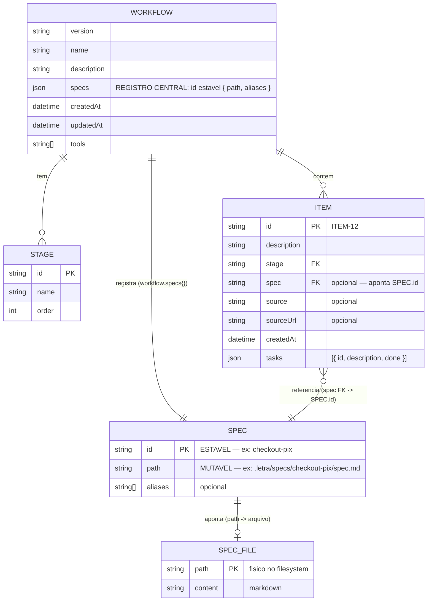

# Conceitos, Arquitetura e Modelo de Dados

> Documento de refino — registra a discussão sobre especificação, item de backlog, tarefa e o modelo resiliente de dados.

## 1. Conceitos

### Spec (Especificação)

**Definição:** A regra de negócio, o contrato do que precisa ser entregue. É o **"por quê"** e **"o que"**.

| Característica | Descrição |
|---|---|
| Mudança | Rara, negociada, versionada |
| Quem escreve | Tech lead, PM, cliente |
| Conteúdo | Outcome, Constraints, Acceptance Criteria |
| Vida | Independente do workflow — pode existir sem itens |
| Anda no kanban? | **Não.** A spec é um documento estável que serve de referência |

**Exemplo:**
```
.letra/specs/checkout-pix/spec.md
├── Outcome: Usuário paga via PIX em até 5s
├── Constraints: QR Code dinâmico, confirmação webhook
├── Exclusions: Parcelamento
└── Acceptance Criteria: [ ] Gerar QR Code, [ ] Confirmar em tempo real
```

---

### Item de Backlog

**Definição:** Unidade de entrega com valor de negócio. O **"quando"** — uma fatia concreta e implementável da spec.

| Característica | Descrição |
|---|---|
| Mudança | Frequente — refinada, priorizada, movida |
| Quem escreve | Time, baseado na spec |
| Conteúdo | Descrição executável, tasks atômicas |
| Vida | Anda no workflow: Backlog → Design → Code → Tests → Review → Done |
| Anda no kanban? | **Sim.** É a unidade que se move entre os estágios |

**Exemplo:**
```
ITEM-12  Criar tela de QR Code dinâmico
  ├── Estágio atual: Code
  ├── Spec vinculada: checkout-pix
  └── Tasks:
        ├── TASK-1  Criar rota POST /api/pix/qrcode      ✅ done
        ├── TASK-2  Implementar componente QR Code        🔄
        └── TASK-3  Testar geração de QR com valor inválido
```

---

### Tarefa (Task)

**Definição:** Unidade de execução. O **"como"** — passo mais atômico que um agente ou pessoa executa.

| Característica | Descrição |
|---|---|
| Mudança | Alta — descoberta durante o trabalho |
| Quem escreve | Quem executa (dev, LLM) |
| Conteúdo | Comando técnico, arquivo, função |
| Vida | Dentro do item — não anda no workflow global |
| Anda no kanban? | **Não.** Anda dentro do item — como checklist ou sub-kanban |

---

## 2. Modelo de Dados

### Estrutura do `workflow.json`

O `workflow.json` é o **registro central** do projeto. Tudo que importa — specs, itens, tarefas, vínculos — está aqui, versionado, diffável, mergeável.

```json
{
  "version": "1.0",
  "name": "Letra Spec Driven",
  "description": "...",

  "specs": {
    "checkout-pix": {
      "path": ".letra/specs/checkout-pix/spec.md",
      "aliases": ["pix", "pagamento-pix"]
    },
    "login-sso": {
      "path": ".letra/specs/login-sso/spec.md"
    }
  },

  "stages": [
    { "id": "backlog", "name": "Backlog", "order": 0 },
    { "id": "design",  "name": "Design",  "order": 1 },
    { "id": "code",    "name": "Code",    "order": 2 },
    { "id": "tests",   "name": "Tests",   "order": 3 },
    { "id": "review",  "name": "Review",  "order": 4 },
    { "id": "done",    "name": "Done",    "order": 5 }
  ],

  "items": [
    {
      "id": "ITEM-12",
      "description": "Criar tela de QR Code dinâmico",
      "stage": "code",
      "spec": "checkout-pix",
      "createdAt": "2026-06-07T21:45:59.038Z",
      "tasks": [
        { "id": "TASK-1", "description": "Criar rota POST /api/pix/qrcode",      "done": true },
        { "id": "TASK-2", "description": "Implementar componente QR Code",        "done": false },
        { "id": "TASK-3", "description": "Testar geração de QR com valor inválido","done": false }
      ]
    }
  ],

  "tools": ["opencode", "vscode"]
}
```

### Diagrama ER



### Cardinalidades

```
SPEC  1 ──── N ITEMS      (uma spec pode ter varios itens)
ITEM 1 ──── N TASKS      (um item se decompoe em varias tarefas)
STAGE 1 ──── N ITEMS     (um estagio contem varios itens)
```

---

## 3. Resiliência contra Mudanças no Filesystem

O problema central resolvido por este modelo: **o vinculo entre item e spec nao depende do nome da pasta no filesystem.**

| Acao do usuario | Efeito | Como resolver |
|---|---|---|
| Renomear pasta `checkout-pix` -> `pix` | So atualizar `path` no `specs{}` | `letra spec update checkout-pix --path .letra/specs/pix/spec.md` |
| Mover spec para outro local | Atualizar `path` | Idem |
| Apagar pasta da spec acidentalmente | `letra validate` detecta path invalido | Aviso: "Spec 'checkout-pix': path nao encontrado" |
| Duas pastas com mesmo conteudo | IDs unicos no `specs{}` impedem conflito | O JSON nao permite chave duplicada |
| Merge conflict no `workflow.json` | Resolvido pelo Git (ja acontece hoje) | Sempre foi gerenciável |

**Principio:** o `workflow.json` e a fonte da verdade. O filesystem (`.letra/specs/`) e apenas **cache de conteudo** — o spec.md pode ser recriado a partir do contrato, mas o vinculo esta no JSON versionado.

---

## 4. Fluxo de Resolucao de Spec

Quando o kanban renderiza um item:

```
ITEM: { spec: "checkout-pix" }
              |
              v
    workflow.specs["checkout-pix"]?
              |
        +-----+-----+
        v           v
     EXISTE       NAO EXISTE
        |             |
        v             v
  Le o path     Fallback: busca por aliases
  -> spec.md    Fallback 2: matching por descricao
  -> renderiza  -> "Spec nao encontrada"
```

---

## 5. Como o Kanban Exibe os Conceitos

### Card do Item (fechado)

```
+--------------------------------------+
| ITEM-12  [code]                      |
|                                      |
| Criar tela de QR Code dinamico       |
| progress: [#####...] 1/3 tasks       |
| spec: checkout-pix                    |
+--------------------------------------+
```

### Card do Item (expandido — revela tasks)

```
+--------------------------------------+
| ITEM-12  [code]                      |
|                                      |
| Criar tela de QR Code dinamico       |
|                                      |
| Tasks:                               |
|  + TASK-1  Criar rota POST /api/pix  |
|  ~ TASK-2  Componente QR Code       |
|  o TASK-3  Testar valor invalido    |
|                                      |
| progress: 1/3 tasks                  |
| spec: checkout-pix  [abrir spec]     |
+--------------------------------------+
```

### Agrupamento por Spec no Board

```
Backlog:
  +- Spec: checkout-pix --------------+
  | ITEM-13  Criar webhook confirmacao |
  | ITEM-15  Validacao de chave PIX    |
  +------------------------------------+

Code:
  +- Spec: checkout-pix --------------+
  | ITEM-12  Tela de QR Code (1/3)   |
  +------------------------------------+
```

---

## 6. Comandos Futuros

| Comando | Descricao |
|---|---|
| `letra spec link ITEM-12 checkout-pix` | Vincula item a uma spec |
| `letra spec unlink ITEM-12` | Remove vinculo |
| `letra spec update checkout-pix --path <novo>` | Atualiza path apos renomear/mover pasta |
| `letra task add ITEM-12 "descricao"` | Adiciona tarefa a um item |
| `letra task done ITEM-12 TASK-1` | Marca tarefa como concluida |
| `letra validate --specs` | Verifica integridade dos vinculos spec<->item |

---

## 7. Decisoes de Design

| Decisao | Motivo |
|---|---|
| `workflow.json` como registro central | Unico arquivo versionado, diffavel, mergeavel |
| SPEC.id desacoplado do path | Resiste a renomeacao/movimentacao de pastas |
| Tasks dentro do item | Nao precisam de workflow proprio, andam com o item |
| Spec nao anda no kanban | Spec e contrato estavel, item e entrega executavel |
| Fallback por descricao | Mantem compatibilidade com dados existentes |

---

## 8. Acesso

Este documento esta disponivel em:

- **No repositorio:** `.letra/docs/conceitos-e-arquitetura.md`
- **GitHub Wiki:** (em breve — acesse https://github.com/jspengine/letra/wiki)
