# Letra Architecture Current State — Deep Analysis

**Date**: 2026-06-27
**Status**: Draft
**Scope**: Current-state architecture, memory model, design tensions, drift against constitution, and refactoring roadmap
**Related Spec**: `activity-context`

---

## Purpose

This document describes how Letra is architected today, not how it was originally intended to be. The goal is to make the present structure explicit, identify where implementation already matches the constitution, and expose where design drift or accidental coupling has emerged.

This is a diagnostic artifact. It is not a future-state proposal by itself, but it ends with a prioritized roadmap for convergence.

---

## Executive Summary

Letra already has the shape of a strong orchestration product:

- a workspace-centric operational model
- a unified flow state around `.letra/workflow.json`
- persistent operational memory (`focus`, `context`, `health`, `session-log`, `decisions`)
- both CLI and Web UI reading from the same workspace state
- an explicit harness layer with flows, gates, roles, and policies

However, the system is still split between two competing architectural centers:

1. **Declarative authority** in harness and workspace files
2. **Embedded authority** in CLI/UI TypeScript logic

This creates a transitional architecture: configurable in form, but partially hardcoded in behavior.

Current architectural score: **7/10**

Main conclusion:

> The deepest architectural problem in Letra today is not missing structure. It is the gap between the constitutional claim that “Harness is Authority” and the implementation reality that many critical semantics still live in code.

---

## High-Level Architecture

```mermaid
flowchart TB
  subgraph UX["Experience Layer"]
    CLI["CLI Commands\nCommander / Ink"]
    WEB["Web UI\nReact / Vite"]
    SSECLIENT["SSE Client\nReconnect Wrapper"]
  end

  subgraph RUNTIME["Runtime Layer"]
    SERVER["FlowServer\nHTTP API + SSE + SPA host"]
  end

  subgraph APP["Application Layer"]
    FLOW["Workflow Operations"]
    PHASE["Phase Engine"]
    ACTX["Activity Context Builder"]
    DIAG["Diagnostic Engine"]
    FOCUS["Focus Sync"]
    SITREP["Pulse + Sitrep"]
    HSNAP["Harness Snapshot / Adapter Context"]
    WORKSPACE["Workspace Resolver"]
    HLOAD["Harness Loader"]
  end

  subgraph MEMORY["Workspace Memory"]
    WF[".letra/workflow.json"]
    SPEC[".letra/specs/*"]
    FMD[".letra/focus.md"]
    CTX[".letra/context.md"]
    CONST[".letra/constitution.md"]
    HEALTH[".letra/health-record.json"]
    LOG[".letra/session-log.json"]
    DEC[".letra/decisions/*"]
    SNAP[".letra/snapshots/*"]
  end

  subgraph AUTH["Authority Artifacts"]
    HFLOW["harness/flows/*.yaml"]
    HGATE["harness/gates/*.yaml"]
    HROLE["harness/roles/*.yaml"]
    HPOL["harness/policies/*.json"]
    BUILTIN["Built-in defaults\nin code"]
  end

  subgraph REG["Global Registry"]
    WSREG["~/.letra/workspaces/*"]
    MANIFEST["letra.manifest.json"]
    LINK[".letra-link"]
  end

  CLI --> FLOW
  CLI --> PHASE
  CLI --> DIAG
  CLI --> SITREP
  CLI --> ACTX

  WEB --> SSECLIENT
  WEB --> SERVER
  SSECLIENT --> SERVER

  SERVER --> FLOW
  SERVER --> DIAG
  SERVER --> ACTX
  SERVER --> FOCUS
  SERVER --> SITREP
  SERVER --> WORKSPACE
  SERVER --> HLOAD

  FLOW <--> WF
  FLOW <--> SPEC
  FOCUS <--> FMD
  SITREP <--> CTX
  SITREP <--> LOG
  DIAG <--> HEALTH
  DIAG <--> SNAP
  ACTX --> WF
  ACTX --> SPEC
  ACTX --> FMD
  ACTX --> HEALTH
  ACTX --> LOG
  HSNAP --> WF
  HSNAP --> FMD
  HSNAP --> HEALTH
  HSNAP --> LOG

  WORKSPACE --> WSREG
  WORKSPACE --> MANIFEST
  WORKSPACE --> LINK

  HLOAD --> HFLOW
  HLOAD --> HGATE
  HLOAD --> HROLE
  HLOAD --> HPOL
  PHASE --> HLOAD
  PHASE --> BUILTIN

  CONST -. normative constraints .-> CLI
  CONST -. normative constraints .-> WEB
  CONST -. normative constraints .-> SERVER
  CONST -. normative constraints .-> APP
```

---

## Layer-by-Layer Reading

### 1. Experience Layer

The user interacts with Letra through two primary surfaces:

- **CLI** for direct operational commands
- **Web UI** for board, diagnostics, focus, context, setup, and supervision

These surfaces are not independent products. They are alternative control planes over the same workspace state.

This is a strong design decision because:

- behavior can be observed through more than one interface
- traceability remains anchored in files
- operational state survives the UI process itself

But there is also a current weakness:

- the Web UI still contains significant domain semantics that should belong to the flow or harness

---

### 2. Runtime Layer

`flow-serve` currently acts as a local application server, API host, SSE hub, static host, workspace switcher, diagnostics scheduler, and orchestration façade.

This gives the product speed of iteration, but also concentrates too many responsibilities into one module.

Current role set:

- serves HTTP routes
- serves the SPA or proxies Vite
- watches workflow/spec files
- pushes SSE updates
- runs periodic diagnostics
- mutates workflow/spec/focus/health state
- exposes activity-context as API

This is the largest current monolith in the system.

---

### 3. Application Layer

This layer is where most of Letra’s real product value lives today.

#### 3.1 Workflow Operations

The workflow is the transactional backbone of the product:

- stages
- items
- stage order and zones
- spec links
- tools
- primary item
- handoff metadata
- current phase on items

The design is strong because many derived systems rely on this same source instead of keeping duplicate state.

#### 3.2 Phase Engine

The phase engine models sub-state within a stage, which is the right direction for review and gate loops.

But its fallback definitions are still embedded in code. This means phase semantics are only partially declarative.

#### 3.3 Activity Context

The activity-context builder is an important architectural step upward:

- it converts raw workspace artifacts into a situational view
- it recuts context based on activity
- it reduces context volume through summarization and references

This is likely the right future direction for all adapters and UI supervision.

Its current weakness is that some of its semantic interpretation still depends on hardcoded stage and phase names.

#### 3.4 Diagnostic Engine

Diagnostics already behave like a lightweight continuous architecture auditor:

- detector-based
- auto-fix capable
- snapshot-backed
- health-persistent

This is one of the strongest subsystems in the product.

#### 3.5 Pulse and Sitrep

`pulse` and `sitrep` form a derived memory pair:

- `pulse` reads operational state and summarizes it
- `sitrep` rewrites contextual narrative into `context.md`

This is a useful design because it distinguishes between:

- canonical operational state
- synthesized human-readable context

---

## Component Inventory

### Core operational modules

- `packages/cli/src/workspace/resolver.ts`
- `packages/cli/src/workspace/index.ts`
- `packages/cli/src/harness/loader.ts`
- `packages/cli/src/commands/flow-serve.ts`
- `packages/cli/src/commands/flow-move.ts`
- `packages/cli/src/commands/pulse.ts`
- `packages/cli/src/commands/sitrep.ts`
- `packages/cli/src/phases/engine.ts`
- `packages/cli/src/diagnostics/engine.ts`
- `packages/cli/src/activity-context/sources.ts`
- `packages/cli/src/activity-context/builder.ts`
- `packages/cli/src/adapters/builder.ts`
- `packages/cli/src/session-log.ts`
- `packages/cli/src/health-record.ts`

### UI modules with domain semantics

- `packages/client/src/App.tsx`
- `packages/client/src/components/Home/HomeView.tsx`
- `packages/client/src/components/Flow/FlowView.tsx`
- `packages/client/src/components/Flow/KanbanBoard.tsx`
- `packages/client/src/components/Execution/ExecutionView.tsx`
- `packages/client/src/lib/withReconnect.ts`

---

## Memory Model

Letra already implements a multi-level memory system, even if it is not yet named explicitly in code.

### L0 — Transactional State

**Artifact**: `.letra/workflow.json`

Purpose:

- source of truth for items, stages, stage order, links, and execution position
- primary operational state of the workspace

Properties:

- highest operational authority inside the workspace
- mutable
- expected to be consistent and machine-readable

### L1 — Focus Memory

**Artifact**: `.letra/focus.md`

Purpose:

- state the current session focus
- bind a session to a spec or item

Properties:

- mutable
- small
- used to reduce ambiguity and drift

### L2 — Normative Memory

**Artifact**: `.letra/constitution.md`

Purpose:

- define invariants and non-negotiable product rules

Properties:

- should be higher than implementation preferences
- should constrain all layers
- currently not fully enforced by code

### L3 — Situational Memory

**Artifact**: `.letra/context.md`

Purpose:

- maintain a human-readable synthesis of current state
- preserve local narrative continuity

Properties:

- derived
- periodically rewritten
- not canonical for workflow behavior

### L4 — Specification Memory

**Artifact**: `.letra/specs/*`

Purpose:

- preserve intended outcome, constraints, exclusions, and ACs
- bind changes to explicit scope

Properties:

- semi-structured
- human-authored or agent-assisted
- required by constitution for non-trivial work

### L5 — Health Memory

**Artifact**: `.letra/health-record.json`

Purpose:

- persist architecture and operational alerts over time
- distinguish new, acknowledged, dismissed, and resolved findings

Properties:

- durable
- machine-readable
- detector-driven

### L6 — Historical Memory

**Artifact**: `.letra/session-log.json`

Purpose:

- keep operational event history
- serve recent activity evidence to adapters, context builders, and audit views

Properties:

- append-like behavior with capped retention
- excellent for recency signals

### L7 — Reversible Memory

**Artifact**: `.letra/snapshots/*`

Purpose:

- enable undo/redo of auto-fixes and diagnostics actions

Properties:

- rollback-oriented
- useful for “Nothing is Magic”

---

## Memory Matrix

| Level | Artifact | Role | Canonical? | Human-facing? | Mutable? |
|---|---|---|---|---|---|
| L0 | `workflow.json` | operational state | yes | partially | yes |
| L1 | `focus.md` | session focus | no | yes | yes |
| L2 | `constitution.md` | normative rules | yes for policy | yes | rare |
| L3 | `context.md` | situational synthesis | no | yes | yes |
| L4 | `specs/*` | intended work contract | yes for scope | yes | yes |
| L5 | `health-record.json` | persistent alerts | yes for health state | partially | yes |
| L6 | `session-log.json` | historical evidence | yes for audit trail | partially | yes |
| L7 | `snapshots/*` | reversible mutations | yes for rollback | no | yes |

---

## Architectural Strengths

### 1. Shared file-based state across surfaces

Both CLI and Web UI operate on the same workspace artifacts. This avoids fractured local stores and makes the system inspectable.

### 2. Strong workspace-first direction

The resolver already supports:

- local mode
- manifest mode
- linked mode
- env-selected mode
- flag-selected mode

This is a strong base for the constitutional “Workspace is Context” principle.

### 3. Persistent health model

The health subsystem is not just a live lint output. It stores lifecycle state for findings. This is a mature design choice.

### 4. Diagnostic engine with reversible fixes

Auto-fixes are snapshot-backed, which is a direct win for auditability and rollback.

### 5. Emergent situational context layer

The activity-context builder is a meaningful step toward a proper orchestration layer above raw files and below adapters/UI.

---

## Architectural Tensions and Drift

### Tension 1 — Harness authority vs code authority

This is the most important structural tension in the codebase.

The constitution says:

> all behavior must be defined in harness, not hardcoded in CLI

Current reality:

- flow templates still exist in code
- UI stage labels and execution semantics still exist in code
- phase fallbacks still exist in code
- activity-context interpretation still exists in code

Result:

- behavior is split between declarative artifacts and imperative logic
- changing a flow often still requires a code release

### Tension 2 — Workspace-first vs residual project-centric language

The constitution forbids “project” as the root aggregate, but the implementation still contains:

- `projectRoot`
- `projectType`
- “Projetos” in the UI

This is not only naming drift. It suggests unresolved conceptual layering between workspace and target repository.

### Tension 3 — Thin adapter goal vs heavy server orchestrator

`flow-serve` currently holds too much behavior. Instead of being a transport adapter over domain services, it is also a domain coordinator.

This creates:

- harder testing boundaries
- tighter coupling across concerns
- slower future evolution

### Tension 4 — No silent automation vs background diagnosis

Diagnostics run automatically on server start and every 30 seconds.

That is operationally useful, but constitutionally dangerous unless the user can clearly see:

- who acted
- what ran
- why it ran
- what changed

Today the trace exists, but the behavior is still closer to background automation than explicit supervised action.

### Tension 5 — Canonical writes vs distributed file mutation

There is a visible effort toward centralized workflow writing, but the broader system still writes many artifacts directly.

That means:

- write policies are uneven
- invariants can be bypassed
- audit semantics differ by subsystem

---

## Constitution Drift Matrix

### Principle 1 — Human in the Loop

**Alignment**

- gates are modeled in harness
- flow move already blocks some human gates unless forced

**Drift**

- some transitions and semantic expectations are still inferred from code instead of declared in harness
- review/gate meaning is not fully driven by artifacts

### Principle 2 — Workspace is Context

**Alignment**

- workspace resolver is already central
- registry and linking model exist

**Drift**

- project-centric naming still exists in resolver, server, and UI
- UI still exposes “Projetos” as a root concept

### Principle 3 — Harness is Authority

**Alignment**

- loader for flows, gates, roles, policies already exists
- server can expose harness templates

**Drift**

- templates live in code and harness simultaneously
- `flow-move` hardcodes `harness.flows.sdlc`
- phase engine contains built-in phase definitions
- activity-context derives gate/review expectations from stage names

### Principle 4 — Nothing is Magic

**Alignment**

- diagnostics use snapshots
- health is persisted
- session log exists

**Drift**

- not all automatic behavior is surfaced as explicit supervised events
- some writes still occur outside a unified domain-level write gateway

### Principle 5 — LLM is a Tool, Not the Owner

**Alignment**

- no model-owned runtime inside Letra
- gates remain explicit at the product level

**Drift**

- UI still frames some flow behavior as stage mechanics rather than agent/human interaction
- the constitution’s “agent behavior first” is not yet fully reflected in dashboard semantics

### UX Constitution — No silent automation

**Alignment**

- there is audit and health persistence

**Drift**

- periodic diagnostics are automatic
- the Web UI does not always foreground “who acted / why now”

### UX Constitution — Harness first, CLI second

**Alignment**

- harness system exists and is structurally important

**Drift**

- too much behavior still originates in CLI and Web code

### UX Constitution — Every command has dry-run

**Alignment**

- some commands already support `--dry-run`

**Drift**

- many flow and state-mutating commands still do not

---

## Concrete Drift Hotspots

### 1. Hardcoded templates in server

The server still defines workflow templates directly in code. This duplicates flow semantics outside the harness and creates two sources of truth.

### 2. SDLC hardcode in flow routing

`flow` accepts a template option, but behavior still effectively assumes `sdlc` in key command paths.

### 3. SDLC hardcode in gate enforcement

`flow-move` explicitly reads `harness.flows.sdlc` instead of resolving the active flow from workspace state.

### 4. Built-in phase semantics

The phase engine includes embedded review states such as:

- `auto-review`
- `code-fix`
- `human-review`

This makes code, not harness, the final semantic authority.

### 5. UI-owned stage semantics

The UI still embeds:

- stage order
- stage labels
- agent labels
- gate stage assumptions

This makes the UI partially authoritative about process.

### 6. Activity-context semantic coupling

The current activity-context builder interprets:

- review semantics from `currentPhase`
- gate semantics from `stageId`

This solves the immediate product need, but couples activity intelligence to one current flow dialect.

### 7. Background diagnostics scheduler

The server runs diagnostics on startup and on a repeating timer. This is useful, but the architecture still needs a more explicit supervision contract around it.

---

## Architectural Assessment by Subsystem

| Subsystem | Score | Assessment |
|---|---:|---|
| Workspace resolution | 9 | strong and extensible |
| Workflow state model | 8 | solid backbone, still not fully normalized around active flow definition |
| Harness loader | 8 | good foundation, underused as authority |
| Phase engine | 6 | useful capability, too much fallback semantics in code |
| Activity context | 7 | correct direction, still semantically coupled |
| Diagnostics | 9 | one of the strongest systems |
| Health persistence | 9 | mature and product-worthy |
| Session log | 8 | very useful operational memory |
| Flow server | 5 | valuable but too monolithic |
| Web UI architecture | 6 | effective product surface, still too behavior-owning |

---

## Current-State Target Model

The architecture that seems to be emerging organically is:

1. **Workspace as solution root**
2. **Workflow as operational ledger**
3. **Harness as semantic authority**
4. **Activity-context as situational projection**
5. **CLI/Web as transport and supervision surfaces**

This is a good architecture.

The problem is that Letra has not fully completed the migration into that model yet.

---

## Prioritized Refactoring Roadmap

### Priority 0 — Make authority singular

Goal:

- eliminate duplicate semantic ownership

Actions:

- remove hardcoded templates from runtime server
- resolve active flow/template from workspace and harness only
- stop referencing `harness.flows.sdlc` directly in command logic

Expected gain:

- immediate reduction in drift
- safer future flow evolution

### Priority 1 — Extract a normalized flow-definition service

Goal:

- provide one internal API that resolves the active flow semantics

Actions:

- create a module that returns normalized stages, gates, roles, phases, labels, review expectations, gate expectations, and UI hints
- have CLI, server, UI, and activity-context consume that service

Expected gain:

- one semantic pipeline
- reduced code duplication

### Priority 2 — Turn UI into renderer, not process owner

Goal:

- remove hardcoded stage order, labels, agents, and gate semantics from UI

Actions:

- drive dashboard, flow, and execution views from resolved flow definition
- make stage presentation declarative

Expected gain:

- true harness-first UI
- lower release cost for flow changes

### Priority 3 — Split `flow-serve` into application services

Goal:

- reduce server monolith risk

Suggested boundaries:

- workflow API
- workspace API
- diagnostics API
- specs API
- context API
- events/sse module
- setup/onboarding API

Expected gain:

- clearer dependency graph
- lower coupling
- better testability

### Priority 4 — Promote activity-context from utility to core projection

Goal:

- make activity-context the main way the system serves situational state

Actions:

- move review/gate expectations from hardcoded heuristics into harness flow metadata
- let adapters and UI consume the same projection

Expected gain:

- less context drift
- fewer ad hoc interpretations in surfaces

### Priority 5 — Formalize automation visibility

Goal:

- bring background behavior fully under supervision semantics

Actions:

- expose diagnostic runs as visible agent/system actions
- differentiate passive scans from state-mutating auto-fixes
- surface timing, cause, and effect in UI

Expected gain:

- constitution compliance
- stronger trust model

### Priority 6 — Consolidate write policy

Goal:

- approach a real domain write gateway across state artifacts

Actions:

- classify files into canonical, derived, and evidence artifacts
- define write ports for each class
- reduce scattered direct file writes where domain invariants matter

Expected gain:

- stronger consistency guarantees
- cleaner rollback story

---

## What Must Not Happen Next

To stay aligned with the constitution, Letra should avoid these next-step mistakes:

1. adding more hardcoded stage semantics to the Web UI
2. adding new flow templates only in TypeScript
3. teaching `activity-context` additional stage-specific heuristics in code
4. expanding `flow-serve` with more domain logic before modularizing it
5. reintroducing “project” as the primary aggregate in new APIs or views

---

## Final Assessment

Letra is not architecturally broken.

It is architecturally **split**.

The good news is that the dominant direction is already visible:

- workspace-centered
- file-auditable
- harness-capable
- memory-aware
- human-supervised

The work now is not to invent a new architecture.

The work is to **finish the migration** into the architecture the constitution already describes.

When that happens, Letra stops being a smart CLI/Web app with configurable pieces and becomes what it is trying to be:

> an orchestration system whose behavior is declarative, inspectable, workspace-centered, and situationally intelligent.

