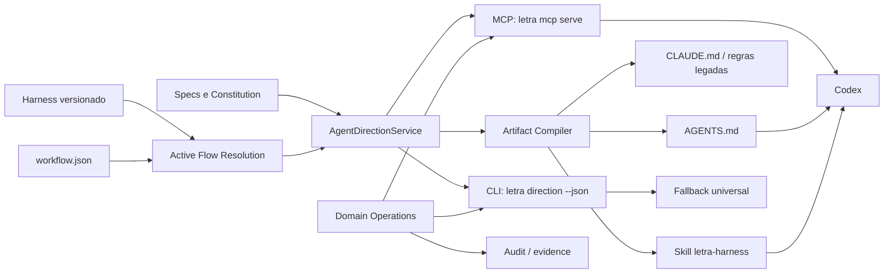

# Design: Adapter Platform v2

> Spec: `adapter-platform-v2`
> Item: `ITEM-64`
> Date: 2026-07-04
> Status: Proposed

## 1. Decisão

O Letra adotará uma plataforma universal de adapters baseada em capacidades. O Codex será a implementação de referência, porém nenhum conceito central poderá depender do Codex.

Um adapter deixa de ser entendido como "um arquivo de instruções" e passa a ser uma composição de quatro elementos:

1. **Bootstrap**: instruções carregadas automaticamente pela ferramenta.
2. **Contexto vivo**: leitura estruturada e atualizada do harness.
3. **Operações controladas**: ações que passam pelos serviços e guardas do domínio.
4. **Evidência**: rastros observáveis das consultas relevantes e mutações.

O harness define a direção. O `AgentDirectionService` resolve essa direção. CLI e MCP são transportes. Os adapters apenas selecionam os transportes e artefatos compatíveis.

## 2. Problema atual

O modelo atual possui quatro fragilidades:

- `TOOL_TARGETS` associa diretamente ferramenta, arquivo e formato.
- OpenCode e Codex disputariam `AGENTS.md` caso Codex fosse incluído no loop atual.
- O snapshot dinâmico escrito em arquivo pode ficar obsoleto durante uma sessão.
- Cada nova capacidade tende a ser implementada como condição específica da ferramenta.

Há ainda uma divergência de contrato: o spec `adapter-codex-cli` declara suporte concluído por compatibilidade, enquanto o Codex não aparece no registro, setup ou diagnóstico.

## 3. Princípios

### 3.1 Harness como autoridade

Nenhuma instrução, permissão ou próxima ação pode ser criada pelo renderer, MCP ou skill. Dados ausentes permanecem ausentes e são apresentados como lacuna de configuração.

### 3.2 Um serviço, múltiplos transportes

CLI, MCP, Web e arquivos derivados usam o mesmo `AgentDirectionService`.

### 3.3 Artefato tem um único escritor

Ferramentas podem compartilhar um artefato, mas o artefato possui somente uma definição e um renderer.

### 3.4 Estado vivo vence snapshot

O snapshot em arquivo é fallback. Quando o MCP ou comando de direção estiver disponível, sua revisão mais recente prevalece.

### 3.5 Guardas no domínio

Validação de AC, gates, transições e evidência não depende da obediência do agente nem de hooks do Codex.

### 3.6 Degradação visível

Uma integração parcial deve declarar sua limitação. O produto não exibirá MCP ativo, direção atualizada ou ação registrada sem evidência operacional.

## 4. Visão arquitetural



## 5. Política de artefatos

| Artefato | Classe | Autoridade | Escritor |
|---|---|---|---|
| `.letra/workflow.json` | Canônico transacional | Workspace | Serviços de domínio |
| `.letra/harness/<version>/` | Canônico declarativo | Harness | Comandos de harness |
| `.letra/specs/` | Canônico de intenção | Spec | Ciclo de spec |
| `AGENTS.md` | Derivado compartilhado | Snapshot compilado | Artifact Compiler |
| `.codex/config.toml` bloco Letra | Derivado de integração | Adapter Codex | Config Merger |
| `.agents/skills/letra-harness/` | Derivado procedural | Template do adapter | Artifact Compiler |
| `.letra/session-log.json` | Evidência | Eventos observados | Audit service |
| `.letra/adapters/state.json` | Evidência derivada | Compilação | Artifact Compiler |

Arquivos derivados podem ser regenerados. Arquivos canônicos nunca são reconstruídos a partir de adapters.

## 6. Contratos centrais

### 6.1 Perfil de capacidade

```ts
type LiveContextMode = "none" | "cli" | "mcp";
type RefreshMode = "session-start" | "on-demand";

interface AdapterCapabilityProfile {
  instructions: boolean;
  nestedInstructions: boolean;
  skills: boolean;
  mcp: boolean;
  hooks: boolean;
  liveContext: LiveContextMode;
  refreshMode: RefreshMode;
}

interface AdapterDefinition {
  id: string;
  displayName: string;
  capabilities: AdapterCapabilityProfile;
  artifactIds: string[];
  fallbackTransport: "cli-json";
}
```

O perfil descreve suporte comprovado, não intenção futura. Uma capacidade somente pode ser marcada como ativa quando houver geração, detecção e teste de contrato.

### 6.2 Registro de artefatos

```ts
interface ArtifactDefinition {
  id: string;
  path: string;
  consumers: string[];
  ownership: "letra-owned" | "managed-section";
  refreshOn: Array<"init" | "sync" | "focus" | "flow-move" | "ac-done">;
  render(snapshot: AgentDirectionSnapshot): string;
}
```

O compilador recebe adapters selecionados, calcula a união de `artifactIds`, remove duplicatas e renderiza cada artefato uma única vez. A ordem dos adapters não altera o resultado.

### 6.3 Snapshot de direção

```ts
interface AgentDirectionSnapshot {
  schemaVersion: "1";
  revision: string;
  generatedAt: string;
  source: {
    harnessVersion: string | null;
    flowId: string | null;
    workspaceRoot: string;
  };
  mode: "active" | "degraded" | "unconfigured";
  item: {
    id: string;
    description: string;
    stage: string;
    spec: string | null;
  } | null;
  roleIds: string[];
  allowedStageIds: string[];
  objective: string | null;
  pendingAC: {
    id: string;
    description: string;
  } | null;
  commands: Array<{
    id: string;
    command: string;
    mutates: boolean;
  }>;
  prohibitions: string[];
  requiredEvidence: string[];
  nextActions: Array<{
    id: string;
    label: string;
    reason: string;
  }>;
  warnings: Array<{
    code: string;
    message: string;
  }>;
}
```

`revision` será um hash determinístico da versão do harness, flow resolvido, item ativo, stage, spec/ACs e regras relevantes. `generatedAt` não participa do hash.

## 7. Serviço de direção

Local sugerido:

```text
packages/cli/src/agent-direction/
  types.ts
  service.ts
  revision.ts
  service.test.ts
```

Responsabilidades:

- Resolver workspace, workflow, flow ativo e harness.
- Selecionar o item primário por regra canônica já existente.
- Ler spec e primeiro AC pendente sem depender de regex duplicada.
- Resolver placeholders de comandos.
- Classificar modo ativo, degradado ou não configurado.
- Calcular revisão.
- Retornar dados; nunca escrever adapters ou executar ações.

O builder atual de adapters passa a consumir esse serviço. A migração deve ser incremental para evitar big-bang.

## 8. Compilador de adapters

Local sugerido:

```text
packages/cli/src/adapters-v2/
  registry.ts
  artifacts.ts
  compiler.ts
  config-merge.ts
  profiles/
    codex.ts
    opencode.ts
```

O código atual em `packages/cli/src/adapters/` permanece como fachada durante a migração.

Fluxo de compilação:

1. Resolver adapters selecionados.
2. Validar capacidades e artefatos registrados.
3. Construir um único snapshot.
4. Deduplicar artefatos por ID e caminho.
5. Detectar colisões incompatíveis antes de escrever.
6. Gerar em memória.
7. Persistir atomicamente.
8. Registrar hashes, revisão e resultado.

Colisões nunca são resolvidas por "último escritor vence".

## 9. Adapter Codex

### 9.1 Registro

```ts
{
  id: "codex",
  displayName: "Codex",
  capabilities: {
    instructions: true,
    nestedInstructions: true,
    skills: true,
    mcp: true,
    hooks: true,
    liveContext: "mcp",
    refreshMode: "on-demand"
  },
  artifactIds: [
    "agents-md-shared",
    "codex-project-config",
    "letra-harness-skill"
  ],
  fallbackTransport: "cli-json"
}
```

Hooks são declarados como capacidade da ferramenta, mas não serão ativados na primeira fase. Isso evita transformar um mecanismo que exige confiança do usuário em dependência obrigatória do harness.

### 9.2 `AGENTS.md`

O arquivo terá:

- Regras estáveis e pequenas.
- Referências aos artefatos canônicos.
- Snapshot resumido com `revision`.
- Instrução para consultar `get_direction` antes de planejar, antes da primeira escrita e antes de concluir.
- Fallback `letra direction --json`.
- Regra explícita de que direção viva com revisão mais recente vence o snapshot.

OpenCode continuará recebendo `.opencode/instructions.md`; o `AGENTS.md` compartilhado terá identidade neutra, não o título "OpenCode Adapter".

### 9.3 `.codex/config.toml`

Bloco esperado:

```toml
[mcp_servers.letra]
command = "letra"
args = ["mcp", "serve", "--stdio"]
enabled = true
required = false
```

`required = false` mantém operação em ambientes onde o binário ainda não esteja disponível. A ausência é reportada como degradação, e não como sucesso.

O merger deve:

- Preservar comentários, chaves desconhecidas e configurações do usuário.
- Criar ou atualizar somente `mcp_servers.letra`.
- Recusar conflito estrutural que não possa ser preservado.
- Escrever atomicamente.
- Nunca alterar modelo, autenticação, sandbox, approvals ou outros MCPs.

### 9.4 Skill `letra-harness`

A skill define procedimento, não estado:

1. Consultar direção.
2. Confirmar spec e AC.
3. Proteger comportamento existente com teste.
4. Implementar dentro das permissões.
5. Validar.
6. Registrar evidência.
7. Solicitar transição.

Conteúdo dinâmico é proibido na skill. Isso permite atualização rara e carregamento progressivo.

## 10. Servidor MCP

### 10.1 Transporte

- Comando: `letra mcp serve --stdio`.
- Um processo por sessão do cliente.
- Workspace resolvido pelo diretório da sessão e confinado ao git/workspace root.
- Nenhuma porta HTTP aberta.
- Implementação preferencial com o SDK oficial do Model Context Protocol.

### 10.2 Recursos read-only

| Recurso | Conteúdo |
|---|---|
| `letra://direction` | Snapshot completo |
| `letra://spec/active` | Spec ativa |
| `letra://constitution` | Constituição |
| `letra://health` | Saúde e alertas relevantes |

### 10.3 Ferramentas

| Ferramenta | Tipo | Regra |
|---|---|---|
| `get_direction` | Leitura | Retorna snapshot e revisão |
| `get_active_spec` | Leitura | Retorna spec e AC pendente |
| `get_health` | Leitura | Retorna estado operacional real |
| `validate` | Verificação | Executa validação pelo serviço existente |
| `complete_ac` | Mutação | Exige evidência de regressão e AC vigente |
| `request_transition` | Mutação | Aplica dry-run e guardas de gate |

Ferramentas mutantes retornam:

```ts
interface MutationResult {
  outcome: "accepted" | "rejected" | "approval-required";
  auditId: string;
  beforeRevision: string;
  afterRevision: string;
  reason: string;
  nextDirection: AgentDirectionSnapshot;
}
```

## 11. Fallback CLI

Novo comando:

```text
letra direction --json
```

Ele usa o mesmo `AgentDirectionService` e oferece equivalência de leitura. Operações continuam disponíveis nos comandos canônicos existentes até que uma fachada estruturada comum seja criada.

O fallback não tenta simular MCP. O snapshot retorna:

```json
{
  "mode": "degraded",
  "warnings": [
    {
      "code": "LIVE_CONTEXT_UNAVAILABLE",
      "message": "Use letra direction --json antes de agir."
    }
  ]
}
```

## 12. Protocolo de atualização

1. O cliente consulta `get_direction`.
2. O serviço calcula `revision`.
3. O agente executa trabalho associado à revisão.
4. Antes de mutar estado, envia `expectedRevision`.
5. O serviço recalcula a revisão.
6. Se houver divergência, rejeita com `DIRECTION_STALE`.
7. O agente consulta novamente e reapresenta a decisão.

Esse controle otimista impede conclusão de AC ou transição baseada em contexto vencido.

## 13. Segurança

- Schemas JSON estritos, sem propriedades adicionais em mutações.
- Nenhum parâmetro aceita caminho absoluto ou relativo arbitrário.
- O servidor não recebe comando shell do cliente.
- Comandos declarados pelo harness são apresentados como dados; não são executados por interpolação.
- Escritas usam APIs internas tipadas e confinamento de raiz.
- Symlinks e caminhos resolvidos devem permanecer dentro do workspace.
- Toda transição respeita human gate e políticas do flow ativo.
- Operações mutantes são marcadas para aprovação do cliente quando a superfície suportar essa política.
- Credenciais e configurações pessoais do Codex nunca são lidas ou escritas.

## 14. Auditoria e UX

Eventos mínimos:

- `agent_direction_read`
- `agent_validation_run`
- `agent_ac_completion_requested`
- `agent_transition_requested`
- `agent_operation_rejected`
- `adapter_compiled`
- `adapter_degraded`

Campos mínimos:

```ts
{
  adapter: "codex",
  clientVersion?: string,
  itemId?: string,
  acId?: string,
  revision: string,
  reason: string,
  outcome: string,
  timestamp: string
}
```

Consultas repetidas idênticas podem ser agregadas para evitar ruído. Mutações e rejeições nunca são agregadas. A Web UI deve mostrar ação, causa e resultado sem afirmar identidade não fornecida pelo cliente.

## 15. Rollout incremental

### Fase 0 — Contrato e proteção

- Criar `AgentDirectionSnapshot` e testes de invariantes.
- Introduzir registros de adapters e artefatos.
- Cobrir colisão de `AGENTS.md`.
- Manter saída existente byte-equivalente onde não houver mudança intencional.

### Fase 1 — Codex first-class

- Registrar Codex no CLI, setup e diagnóstico.
- Gerar bootstrap, config e skill.
- Implementar `letra direction --json`.
- Validar fallback antes do MCP.

### Fase 2 — MCP read-only

- Adicionar SDK e servidor `stdio`.
- Expor direção, spec e saúde.
- Validar atualização na mesma sessão.
- Exibir degradação quando indisponível.

### Fase 3 — Operações controladas

- Expor validate, complete_ac e request_transition.
- Adicionar revisão otimista.
- Integrar auditoria e human gates.

### Fase 4 — Expansão cross-adapter

- Migrar OpenCode para o contrato v2.
- Mapear capacidades reais dos demais adapters.
- Ativar MCP, skills ou hooks apenas onde houver suporte comprovado.

Cada fase deve ser um item próprio de Code após aprovação deste design.

## 16. Estratégia de testes

### Unitários

- Resolução de direção ativa, degradada e não configurada.
- Hash estável e mudança de revisão.
- Placeholders e ausência de dados.
- Merge de TOML preservando conteúdo.
- Confinamento de paths.

### Contrato

- Todo adapter possui perfil válido.
- Todo artefato possui escritor único.
- Consumidores compartilhados produzem um único arquivo.
- Ordem de seleção não altera a saída.
- Capacidades declaradas possuem implementação e teste.

### Propriedade

- Nenhuma combinação de adapters gera dois conteúdos para o mesmo path.
- Dados do usuário fora da seção gerenciada permanecem idênticos.
- Revisões iguais representam a mesma direção semântica.

### Integração

- Cliente MCP inicia por `stdio` e consulta snapshot.
- Mudança de stage é percebida sem reinício.
- Revisão vencida bloqueia mutação.
- Gate humano bloqueia transição não aprovada.
- Falha de MCP aciona fallback sem perda de autoridade.

### Dogfooding

- Executar `codex exec --json` em fixture controlada.
- Confirmar item, stage, spec e AC em uma consulta.
- Alterar stage externamente e confirmar nova revisão na mesma execução quando a superfície permitir.
- Tentar concluir AC sem evidência e confirmar rejeição.
- Registrar evidência, validar e concluir pelo caminho autorizado.

## 17. Baseline de regressão

Devem permanecer protegidos:

- Conteúdo L1, workflow snapshot e direção do harness nos adapters existentes.
- Regeneração em init, flow move, focus, health e ac done.
- Formatos `text` e `at`.
- Diagnóstico de adapter stale.
- Compatibilidade de workspaces sem harness, sem workflow ou sem item ativo.
- Gates humanos, auditoria, health record e session log.
- Configurações de usuário fora de blocos gerenciados.

Nenhum AC pode ser concluído sem registrar comportamento protegido, testes executados e risco residual.

## 18. Riscos e mitigação

### Configuração do Codex exige confiança no projeto

Mitigação: apresentar estado `setup-required`, manter fallback CLI e nunca alegar MCP ativo antes de uma consulta bem-sucedida.

### SDK aumenta superfície do bundle

Mitigação: isolar transporte, medir bundle e manter `AgentDirectionService` sem dependência do SDK.

### `AGENTS.md` compartilhado pode exigir compromissos

Mitigação: manter bootstrap neutro e conteúdo específico em `.opencode/instructions.md`, skill e configuração Codex.

### Auditoria de leituras pode gerar ruído

Mitigação: agregar leituras idênticas por sessão e nunca agregar mutações ou rejeições.

### Ferramentas têm capacidades diferentes

Mitigação: capability profile baseado em suporte comprovado e fallback universal via CLI JSON.

### MCP indisponível pode reduzir a experiência

Mitigação: `required = false`, diagnóstico explícito e equivalência de leitura pelo comando `direction`.

## 19. Métricas de sucesso

- 100% dos adapters registrados possuem perfil e testes de contrato.
- Zero colisões silenciosas de artefatos.
- Codex identifica item, stage, spec, AC e próxima ação com uma consulta.
- Mudança canônica aparece na consulta seguinte com revisão diferente.
- 100% das mutações MCP possuem audit ID.
- 100% das transições inválidas são rejeitadas pelo domínio.
- Nenhuma configuração externa ao bloco Letra é alterada.
- O smoke de dogfooding passa em Windows e em ao menos um ambiente Unix de CI.

## 20. Critério para nota 10/10

A avaliação 10/10 somente será considerada alcançada quando o dogfooding demonstrar:

- orientação correta sem leitura manual exploratória;
- atualização durante a sessão;
- proibição efetiva de ações inválidas;
- conclusão com evidência;
- fallback compreensível;
- auditoria visível;
- ausência de regressão nos demais adapters.

Até essa evidência existir, a arquitetura deve ser tratada como hipótese bem desenhada, não como qualidade comprovada.

## 21. Decisões encerradas

- O Codex terá identidade própria no registro.
- `AGENTS.md` continuará compartilhado, mas terá escritor único e identidade neutra.
- MCP será local por `stdio`.
- Hooks não serão autoridade nem requisito da primeira entrega.
- A configuração Codex será project-scoped e preservará conteúdo do usuário.
- O serviço de direção será independente de transporte.
- A migração será incremental, começando por contrato e leitura antes de mutações.
