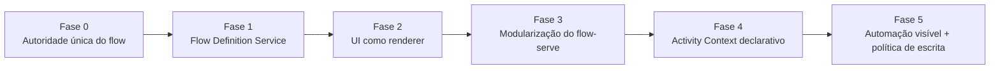

# Architecture Convergence Roadmap

**Spec**: `architecture-convergence`  
**Date**: 2026-06-27  
**Status**: Draft

---

## Goal

Executar a convergência entre a arquitetura declarada na constitution e a arquitetura realmente implementada hoje, sem big-bang refactor e sem quebrar workspaces existentes.

---

## Phase Map

---

## Fase 0 — Autoridade única do flow

### Objetivo

Eliminar as principais fontes duplicadas de semântica do flow e criar uma base clara para resolução do flow ativo do workspace.

### Entregas

- definir como o workspace identifica seu flow ativo
- parar de consultar `harness.flows.sdlc` diretamente em regras de domínio
- remover templates do servidor como fonte primária de comportamento
- documentar fallback de compatibilidade para workspaces legados

### Item de flow

- `Fase 0: Autoridade do flow — remover semântica duplicada entre server/CLI/harness`

---

## Fase 1 — Flow Definition Service

### Objetivo

Criar uma API interna única que normaliza a definição de flow consumida por todas as superfícies.

### Entregas

- `resolveFlowDefinition(workspace)` ou equivalente
- stages, phases, gates, labels, roles e hints de atividade normalizados
- camada compatível com harness atual e legado

### Consumidores iniciais

- `flow-move`
- `flow-serve`
- `activity-context`
- Web UI

### Item de flow

- `Fase 1: Flow Definition Service — resolução única de stages, gates, phases e hints`

---

## Fase 2 — UI como renderer

### Objetivo

Retirar da UI a posse indevida da semântica do processo.

### Entregas

- remover stage order hardcoded da UI
- remover agent labels hardcoded como fonte principal
- remover gates/states fixos do dashboard e execution view
- derivar pipeline e badges do flow ativo resolvido

### Item de flow

- `Fase 2: UI renderer — pipeline, labels e gates derivados do flow ativo`

---

## Fase 3 — Modularização do flow-serve

### Objetivo

Quebrar o monólito de servidor em serviços coesos e testáveis.

### Entregas

- separar APIs de workflow, specs, diagnostics, workspace, context e events
- reduzir acoplamento entre file IO, HTTP, SSE e regras de domínio
- tornar scheduling e side effects mais explícitos

### Item de flow

- `Fase 3: flow-serve modular — separar APIs, eventos e orquestração`

---

## Fase 4 — Activity Context declarativo

### Objetivo

Fazer o `activity-context` ler intenção operacional declarada em vez de inferir tudo por stage/phase name.

### Entregas

- `reviewExpectation`, `gateExpectation` e hints por atividade vindos do flow/harness
- remoção gradual de heurísticas hardcoded em `builder.ts`
- consumo compartilhado entre CLI, Web e adapters

### Item de flow

- `Fase 4: Activity Context declarativo — expectativas e sinais vindos do flow`

---

## Fase 5 — Automação visível + política de escrita

### Objetivo

Alinhar efeitos colaterais e automações com a constitution.

### Entregas

- eventos explícitos para automações recorrentes relevantes
- diferenciação clara entre scan, sugestão, auto-fix e mutação confirmada
- classificação de artefatos por tipo de escrita:
  - canônico
  - derivado
  - evidência
  - rollback

### Item de flow

- `Fase 5: Visibilidade operacional — automações supervisionáveis e política de escrita`

---

## Sequência recomendada

1. Fase 0
2. Fase 1
3. Fase 2 e Fase 3 em paralelo parcial
4. Fase 4
5. Fase 5

---

## Success Signals

- alterar o flow ativo não exige mexer em componentes da UI
- regras de gate/review não dependem de strings hardcoded espalhadas
- `flow-serve` deixa de ser gargalo de semântica
- `activity-context` vira projeção situacional declarativa, não heurística local
- logs e automações ficam mais legíveis para supervisão humana

---

## Related Docs

- `C:\Workspace\letra\.letra\specs\activity-context\architecture-current-state.md`
- `C:\Workspace\letra\.letra\constitution.md`
- `C:\Workspace\letra\.letra\specs\architecture-convergence\write-policy.md`
- `C:\Workspace\letra\.letra\specs\workspace-runtime-governance\write-gateway.md`
