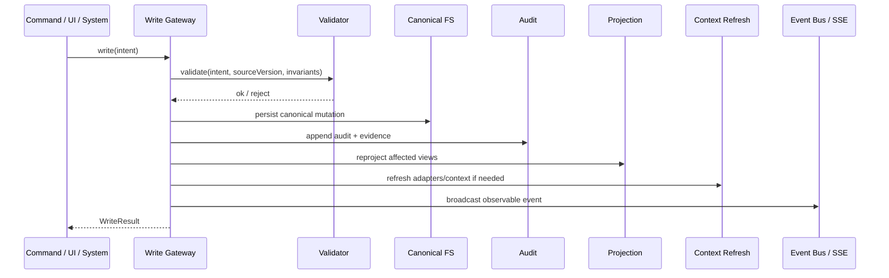

# Write Gateway Contract — workspace-runtime-governance

**Spec**: `workspace-runtime-governance`  
**Date**: 2026-06-28  
**Status**: Draft

---

## Objetivo

Definir o contrato do gateway único de escrita que preserva a integridade entre:

- artefatos canônicos
- projeções derivadas
- evidências
- auditoria
- contexto entregue ao harness

Este documento expande o princípio de `writeWorkflow()` para o cenário evoluído do Letra, onde múltiplos tipos de mutação coexistem dentro do workspace.

---

## Problema que o gateway resolve

Sem um gateway único, o sistema degrada em quatro dimensões:

1. drift entre fontes de estado
2. side-effects inconsistentes
3. auditoria incompleta
4. contexto stale para adapters e LLMs

No modelo futuro, esse risco aumenta, pois além de `workflow.json` também passam a existir:

- mutações de configuração de workspace
- composição de targets e scopes
- configuração de agentes e times
- runs e eventos supervisionados
- projeções derivadas em `PGlite`

---

## Regra central

Toda mutação relevante do domínio deve passar por um gateway explícito.

Esse gateway é responsável por:

1. validar a intenção de escrita
2. aplicar a mutação no artefato canônico correto
3. gerar evidência e auditoria
4. atualizar ou agendar a reprojeção derivada
5. disparar regeneração de contexto quando necessário
6. tornar o efeito observável para supervisão humana

---

## Escopo inicial do gateway

O gateway deve cobrir, no mínimo:

- mutações de `workflow.json`
- mutações de `workspace.json`
- alterações estruturais em targets e scopes
- alterações de configuração de agentes, times e assignments
- criação ou transição de runs supervisionadas
- gravação de eventos estruturados de execução

Ficam fora do gateway inicial:

- logs transitórios puramente efêmeros
- caches locais sem impacto semântico
- leitura e renderização

---

## Contrato conceitual

### Tipos de escrita

```ts
type WriteArtifactKind =
  | "canonical"
  | "derived"
  | "evidence"
  | "rollback";

type WriteSubjectType =
  | "workspace"
  | "target"
  | "scope"
  | "workflow"
  | "flow-definition"
  | "agent"
  | "team"
  | "assignment"
  | "flow-run"
  | "run-item"
  | "run-event";
```

### Intenção de escrita

```ts
interface WriteIntent<TPayload = unknown> {
  workspaceId: string;
  subjectType: WriteSubjectType;
  subjectId?: string;
  action:
    | "create"
    | "update"
    | "archive"
    | "restore"
    | "move"
    | "assign"
    | "unassign"
    | "start-run"
    | "stop-run"
    | "record-event";
  payload: TPayload;
  actor: {
    type: "human" | "agent" | "system";
    id?: string;
  };
  reason?: string;
  expectedSourceVersion?: string;
  requestedEffects?: Array<
    | "audit"
    | "evidence"
    | "reproject"
    | "refresh-context"
    | "broadcast"
  >;
}
```

### Resultado da escrita

```ts
interface WriteResult {
  ok: boolean;
  workspaceId: string;
  subjectType: WriteSubjectType;
  subjectId?: string;
  canonicalWrites: string[];
  derivedWrites: string[];
  evidenceWrites: string[];
  auditIds: string[];
  projectionJobs: string[];
  contextRefresh: "none" | "scheduled" | "completed";
  broadcastEvents: string[];
  newSourceVersion?: string;
  error?: string;
}
```

---

## Responsabilidades do gateway

### 1. Validação

Antes de escrever, o gateway deve validar:

- invariantes de domínio
- formato mínimo do payload
- compatibilidade com a constitution
- lock otimista por `expectedSourceVersion`, quando aplicável
- permissão de automação versus necessidade de gate humano

### 2. Persistência canônica

O gateway decide qual artefato canônico sofre mutação:

- `workspace.json`
- `workflow.json`
- outros arquivos canônicos futuros explicitamente aprovados

### 3. Auditoria

Toda mutação estrutural relevante deve gerar um registro de auditoria com:

- ator
- ação
- alvo
- estado anterior
- estado posterior
- timestamp
- evidências relacionadas

### 4. Evidência

Quando a ação produz artefatos ou sinais relevantes, o gateway deve registrar:

- evento operacional
- referência a artifact
- hashes quando houver conteúdo de IA

### 5. Projeção derivada

Após a persistência canônica, o gateway:

- atualiza a projeção incrementalmente
- ou agenda a reprojeção para um worker/local executor

### 6. Context refresh

Quando a mutação altera o contexto operacional percebido pelo agente, o gateway deve:

- regenerar adapters
- atualizar arquivos de contexto ou foco, quando necessário
- reemitir sinais para a UI e demais consumidores

---

## Sequência operacional recomendada



---

## Categorias de mutação

### Categoria A — Configuração estrutural

Inclui:

- criar/editar/arquivar workspace
- adicionar/remover targets
- criar/editar scopes
- configurar agentes, times e assignments

Efeitos mínimos:

- escrita canônica
- auditoria obrigatória
- reprojeção obrigatória
- refresh de contexto quando alterar contexto ativo

### Categoria B — Estado operacional do fluxo

Inclui:

- mover itens
- alterar stage
- iniciar/parar run
- atribuir trabalho

Efeitos mínimos:

- escrita canônica
- auditoria obrigatória
- evento operacional obrigatório
- reprojeção obrigatória
- refresh de contexto obrigatório

### Categoria C — Evidência e governança

Inclui:

- registrar findings
- anexar artefatos
- registrar geração de IA

Efeitos mínimos:

- evidência obrigatória
- auditoria obrigatória
- reprojeção obrigatória
- refresh de contexto condicional

---

## Política de side-effects

### Obrigatórios

- persistência canônica
- auditoria
- atualização de `sourceVersion`

### Condicionais

- reprojeção incremental
- refresh de adapters
- atualização de `context.md`
- broadcast SSE/UI

### Proibidos

- escrever diretamente em projeção derivada como autoridade final
- atualizar contexto do harness sem vínculo com a mutação causal
- executar side-effect irreversível invisível

---

## Estratégia de versionamento

Cada mutação canônica relevante deve produzir um novo `sourceVersion`.

### Opções aceitáveis

- hash do conteúdo canônico após escrita
- contador monotônico persistido
- timestamp forte com hash complementar

### Recomendação

Adotar hash do conteúdo canônico por artefato principal:

- `workspace.json` → `workspaceSourceVersion`
- `workflow.json` → `workflowSourceVersion`

E derivar uma versão de contexto ativo composta quando necessário.

---

## Estratégia de reprocessamento

### Modo síncrono

Usar quando:

- a projeção afetada é pequena
- a UI precisa refletir imediatamente
- a mutação altera contexto ativo

### Modo assíncrono

Usar quando:

- a reprojeção textual é pesada
- a indexação de documentos pode ser postergada
- o efeito principal já está seguro no canônico

### Regra

Mesmo no modo assíncrono, o gateway deve registrar:

- que a reprojeção foi agendada
- qual job ou checkpoint foi criado

---

## Relação com `writeWorkflow()`

O contrato atual de `writeWorkflow()` continua válido como base.

Evolução recomendada:

1. manter `writeWorkflow()` como gateway especializado para `workflow.json`
2. extrair um gateway mais geral de domínio, por exemplo:

```ts
writeDomainState(intent): WriteResult
```

3. fazer `writeWorkflow()` tornar-se um wrapper especializado sobre esse contrato mais amplo

Isso preserva compatibilidade incremental e evita big-bang refactor.

---

## Integração com auditoria de IA

Quando a mutação envolver conteúdo gerado por IA, o gateway deve exigir ou registrar:

- `provider`
- `model`
- `prompt_hash`
- `context_hash`
- `output_hash`
- vínculo com `run_event`
- política aplicada ou decisão humana relacionada

Isso não significa bloquear toda geração sem esses campos desde o primeiro dia, mas significa que o contrato final do core deve comportá-los nativamente.

---

## Falhas e recuperação

### Falha antes da persistência canônica

- abortar
- não gerar projeção
- registrar erro observável

### Falha após persistência canônica e antes da projeção

- manter o canônico
- registrar erro de projeção
- permitir rebuild posterior

### Falha após projeção e antes do broadcast

- estado continua íntegro
- broadcast pode ser reemitido
- auditoria precisa registrar a falha parcial

---

## Invariantes mínimas

1. nenhuma mutação estrutural relevante pode escapar da auditoria
2. nenhuma projeção derivada pode se tornar fonte primária
3. toda mutação que altera contexto ativo precisa ser rastreável
4. todo side-effect automático relevante precisa ser observável
5. toda reconstrução precisa ser possível a partir do canônico e das evidências

---

## Sinais de sucesso esperados

- diminuição de drift entre `workflow.json`, adapters, contexto e UI
- capacidade de rebuild local sem perda de semântica
- clareza sobre o que mudou, por que mudou e quem causou a mudança
- base segura para introduzir `PGlite` e governança de IA sem duplicação de autoridade
