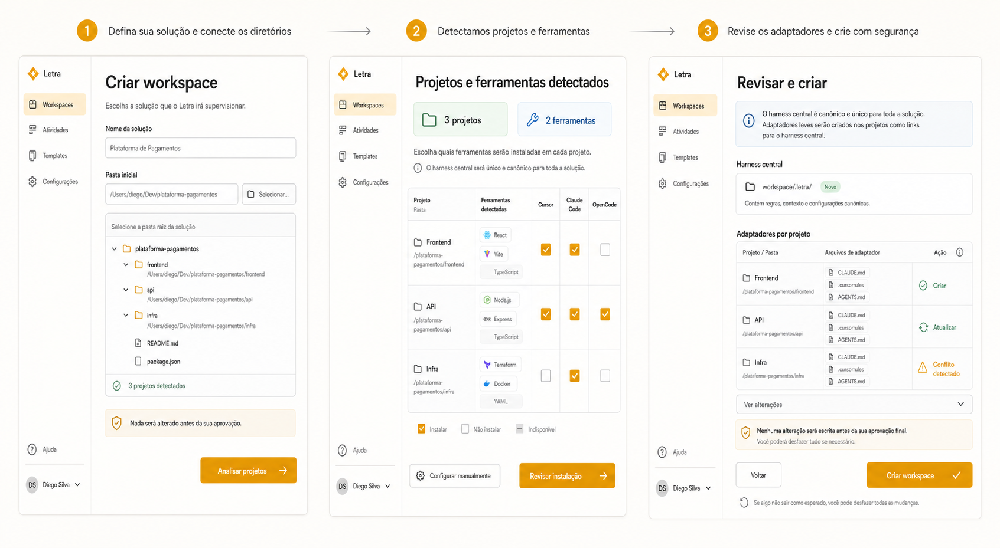

# Design: Configuração Inteligente de Workspace

> Status: aprovado para implementação
> Updated: 2026-07-03

## Referência visual



A imagem orienta hierarquia, linguagem e sequência. Os contratos desta documentação prevalecem quando houver divergência visual.

## Modelo mental

```text
Workspace (solução)
├── Harness canônico (.letra/)
├── Target: frontend
│   ├── Adapter Cursor
│   └── Adapter Claude Code
├── Target: API
│   ├── Adapter Claude Code
│   └── Adapter OpenCode
└── Target: infraestrutura
    └── Adapter Claude Code
```

O usuário escolhe uma solução e suas pastas. O Letra identifica targets e ferramentas, mas somente uma aprovação explícita autoriza qualquer escrita.

## Jornada

### 1. Definir a solução

- Campos essenciais: `Nome da solução` e `Pasta inicial`.
- A seleção de pasta usa navegador local; caminhos comuns aparecem apenas como atalhos.
- A ação principal é `Analisar projetos`.
- A interface declara: “Nada será alterado antes da sua aprovação”.

Ao prosseguir, o servidor valida existência, leitura, escrita potencial e limites de escaneamento. Esta etapa é estritamente read-only.

### 2. Revisar targets e ferramentas

- O Letra apresenta quantos targets e ferramentas foram detectados.
- Cada target exibe nome sugerido, caminho, stack observada e evidências da detecção.
- Uma matriz relaciona targets e adapters.
- Detecção não equivale a seleção: a recomendação pode ser alterada.
- `Configurar manualmente` permite adicionar/remover targets e corrigir resultados.
- A ação principal é `Revisar instalação`.

### 3. Revisar e criar

- O harness central aparece separado dos adapters por target.
- Cada alteração possui estado: `Criar`, `Atualizar`, `Preservar` ou `Conflito`.
- Conteúdo existente nunca é sobrescrito sem estratégia explícita.
- `Ver alterações` mostra diff e origem do conteúdo gerado.
- A ação `Criar workspace` funciona como gate humano.
- A conclusão apresenta resultado por target, evidência registrada e ação de rollback.

## Estados da experiência

| Estado | Comunicação | Ação |
|---|---|---|
| Analisando | Pastas e sinais atualmente avaliados | Cancelar |
| Proposta pronta | Targets e ferramentas encontrados | Editar ou revisar |
| Sem detecção | Nenhuma ferramenta reconhecida | Selecionar manualmente |
| Sem acesso | Caminho e permissão que falharam | Corrigir pasta |
| Conflito | Arquivo existente e risco identificado | Ver diff e escolher estratégia |
| Aplicando | Alteração atual e progresso por target | Não ocultar atividade |
| Parcialmente aplicado | Operações concluídas e falhas | Reverter tudo ou corrigir |
| Concluído | Harness e adapters instalados | Abrir workspace |

## Contratos de domínio

```ts
interface WorkspaceSetupProposal {
  workspace: {
    name: string;
    root: string;
    harnessVersion: string;
  };
  targets: TargetProposal[];
  evidence: DetectionEvidence[];
  warnings: SetupWarning[];
}

interface TargetProposal {
  id: string;
  label: string;
  path: string;
  stack: string[];
  adapters: AdapterProposal[];
}

interface AdapterProposal {
  tool: string;
  state: "detected" | "selected" | "unavailable";
  evidence: string[];
}
```

A proposta é derivada e descartável. O plano aprovado é a entrada do gateway de escrita:

```ts
interface WorkspaceSetupPlan {
  proposalId: string;
  operations: SetupOperation[];
  conflicts: SetupConflict[];
  rollbackManifest: RollbackManifest;
}

type SetupOperation =
  | { kind: "create"; path: string; contentHash: string }
  | { kind: "update"; path: string; beforeHash: string; contentHash: string }
  | { kind: "preserve"; path: string; reason: string };
```

## Estratégia de detecção

As regras de detecção devem ser declarativas e testáveis:

- targets por limites de repositório, manifests e estrutura de monorepo;
- stack por manifests e arquivos conhecidos;
- ferramentas por adapters existentes e configuração local observável;
- evidência associada a toda conclusão;
- limites de profundidade, quantidade e diretórios ignorados configuráveis.

O harness define quais adapters são suportados. A UI não mantém uma lista paralela hardcoded.

## Política de conflitos

- Arquivo inexistente: `Criar`.
- Adapter reconhecido e gerado pelo Letra: `Atualizar`, com diff.
- Arquivo existente não reconhecido: `Conflito`, sem sobrescrita.
- Conteúdo compatível: `Preservar` ou mesclar somente quando o adapter declarar estratégia segura.

Falha em qualquer escrita aciona rollback do plano inteiro. O manifest registra paths, hashes, timestamps e resultado.

## Composição shadcn-first

- `FieldGroup` e `Field` para dados da solução.
- `Dialog` ou seletor nativo mediado pelo servidor para pastas.
- `Table` para a matriz de targets e adapters.
- `Checkbox`, `Badge` e `Tooltip` para estados e evidências.
- `Alert` para permissões e conflitos.
- `Collapsible` ou `Accordion` para diffs e detalhes.
- `Progress` para análise e aplicação.
- `AlertDialog` no gate final quando houver atualizações ou conflitos.

## Implementação incremental

1. Extrair um único núcleo de estado e remover a duplicação entre os dois setup flows.
2. Criar análise read-only e contrato de proposta.
3. Implementar edição de targets e matriz de adapters.
4. Criar dry-run com plano, diff e conflitos.
5. Implementar gateway transacional, manifest e rollback.
6. Integrar a jornada ao primeiro acesso e à gestão de workspaces.
7. Validar responsividade, acessibilidade e regressão de workspaces existentes.

## Decisões aprovadas

1. A interface utiliza `projetos`; o domínio técnico utiliza `target`.
2. Somente ferramentas comprovadamente detectadas são pré-selecionadas; as demais permanecem disponíveis.
3. Na primeira versão, conflitos permitem preservar ou cancelar. Mesclagem assistida fica fora do escopo.
