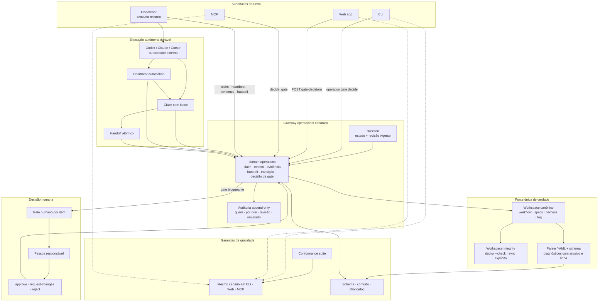

# Convergência Operacional do Harness

> Status: proposta registrada em 2026-09-10. Este mapa orienta as specs de confiabilidade operacional do Letra.

## Objetivo

Qualquer participante — CLI, web app, MCP ou dispatcher — deve observar e alterar o mesmo estado canônico por meio do mesmo contrato. A interface pode mudar; o significado de uma operação, sua validação, a auditoria e o estado resultante não.

## Invariantes

1. O workspace externo é a única autoridade de dados; cópias locais são projeções e nunca autoridade concorrente.
2. Leitura de direção não pode falhar porque a auditoria está indisponível; ela retorna estado e uma advertência explícita de auditoria degradada.
3. Toda mutação recebe identidade, revisão esperada, motivo, resultado e `auditId`.
4. Um gate humano é uma decisão por item. Não existe aprovação global de YAML para substituir uma decisão.
5. Claims, heartbeats e handoffs são duráveis, idempotentes e recuperáveis após reinício.
6. CLI, HTTP e MCP passam pelo mesmo gateway e são verificados por cenários de contrato equivalentes.
7. Arquivos de adapters são projeções idempotentes; estado de execução não cria alterações de configuração sem conteúdo novo.

## Sequência de entrega

1. Integridade do workspace e disponibilidade de direção.
2. Parsing, schema e versão do harness.
3. Gateway único e paridade das superfícies.
4. Leases, heartbeats e recuperação da execução autônoma.
5. Projeções idempotentes, compatibilidade e documentação pública.
6. Suite de conformidade como bloqueio de regressão transversal.

## Relação com specs existentes

- `spec-frontmatter` contribui para a validação estruturada, mas não substitui a validação de arquivos do harness.
- `external-executor-protocol` permanece dependente desta iniciativa; seus AC33–AC36 só são confiáveis depois de gateway, lease e paridade.
